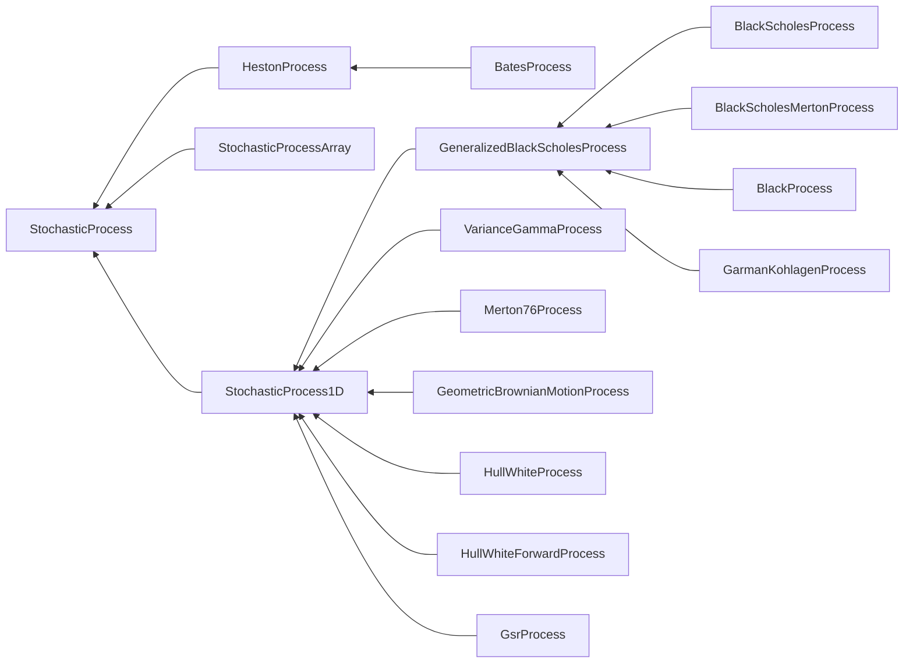

> 由于版本问题，代码可能与最新版不兼容。

# QuantLib 金融计算——随机过程之概述

载入模块

```python
import QuantLib as ql

print(ql.__version__)
```

```
1.12
```

## 框架

随机过程是金融工程中的一个核心概念，是沟通理论分析和计算实践的枢纽。quantlib-python 提供了一组成体系的类架构用于描述实际中最常见到的几种随机过程，以 1.12 版本为例：



C++ 版本的实现提供了更多具体的随机过程。

其中最根本的基类是 `StochasticProcess`，然后衍生出三大类别：
* `HestonProcess`：特殊的二维随机过程——Heston 过程；
  * `BatesProcess`：一种带跳跃的 Heston 过程；
* `StochasticProcessArray`：描述一般的多维随机过程；
* `StochasticProcess1D`：描述常用的若干一维随机过程。
  * `GeneralizedBlackScholesProcess`：Black-Scholes 框架下四种最常用的随机过程
    * `BlackScholesProcess`：$d \ln S ( t ) = \left( r ( t ) - \frac { \sigma ( t , S ) ^ { 2 } } { 2 } \right) d t + \sigma d W _ { t }$
    * `BlackScholesMertonProcess`：$d \ln S ( t , S ) = \left( r ( t ) - q ( t ) - \frac { \sigma ( t , S ) ^ { 2 } } { 2 } \right) d t + \sigma d W _ { t }$
    * `BlackProcess`：$d \ln S ( t ) = - \frac { \sigma ( t , S ) ^ { 2 } } { 2 } d t + \sigma d W _ { t }$
    * `GarmanKohlagenProcess`：$d \ln S ( t ) = \left( r ( t ) - r _ { f } ( t ) - \frac { \sigma ( t , S ) ^ { 2 } } { 2 } \right) d t + \sigma d W _ { t }$
  * `VarianceGammaProcess`
  * `Merton76Process`
  * `GeometricBrownianMotionProcess`：$d S ( t , S ) = \mu S d t + \sigma S d W _ { t }$
  * `HullWhiteProcess`
  * `HullWhiteForwardProcess`
  * `GsrProcess`

基类 `StochasticProcess` 模拟一个 d 维 Ito 过程：

$$
d \mathrm S_t = \mu \left( t , S_t \right) \mathrm d t + \sigma \left( t , \mathrm S_t \right) d \mathrm { W }_t
$$

quantlib-python 默认的离散化方法是 Euler 方法：

$$
S \left( t + \Delta t \right) = \mu \left( t , S_t \right) \Delta t + \sigma \left( t , S_t \right) \Delta W_t
$$

## 用法与接口

随机过程类的用法基本上是首先初始化一个实例，然后并将其传递给其他类的实例，这些类的实例从中提取所需的变量。一个例子是普通的 Black-Scholes 期权定价器，它从随机过程中检索出波动率。另一个例子是蒙特卡罗定价框架中的路径生成器，需要随机过程的参数，生成对应的路径。

`StochasticProcess` 提供下列成员函数：

* `size()`：整数，返回随机过程的维度；
* `initialValues()`：`Array`，返回数组 $S_0$；
* `drift(t, x)`：`Array`，返回数组 $\mu(t,S_t)$；`t` 和 `x` 分别是浮点数和 `Array`；
* `diffusion(t, x)`：`Array`，返回数组 $\sigma(t,S_t)$；`t` 和 `x` 分别是浮点数和 `Array`；
* `expectation(t0, x0, dt)`：`Array`，根据具体的离散方法返回数组 $E \left( S_{ t_0  + \Delta t} \vert S_{ t_0 } = x_0 \right)$；`t0`、`dt` 是浮点数，`x0` 是 `Array`；
* `stdDeviation(t0, x0, dt)`：`Matrix`，根据具体的离散方法返回标准差矩阵 $Std \left( S_{ t_0  + \Delta t} \vert S_{ t_0 } = x_0 \right)$；`t0`、`dt` 是浮点数，`x0` 是 `Array`；
* `covariance(t0, x0, dt)`：`Matrix`，根据具体的离散方法返回协方差矩阵 $Cov \left( S_{ t_0  + \Delta t} \vert S_{ t_0 } = x_0 \right)$；`t0`、`dt` 是浮点数，`x0` 是 `Array`；
* `evolve(t0, x0, dt, dw)`：`Array`，根据 $S_{ t_0}$  和 Brownian 运动增量 $\Delta W$ 产生 $S_{ t_0  + \Delta t}$，默认返回 $E \left( \mathrm S_{ t_0 + \Delta t } \vert S_{ t_0 } \right) + \sigma \left( \mathrm S_{ t_0 + \Delta t } \vert S_{ t_0 } \right) \Delta \mathrm { W }$，其中 $\sigma$ 是标准差（矩阵）.

对于 `StochasticProcess1D` 类，该类继承自 `StochasticProcess` 类，提供了从 `StochasticProcess` 派生的所有函数，但这些函数使用浮点数对象而不是 `Array` 和 `Matrix` 对象。
