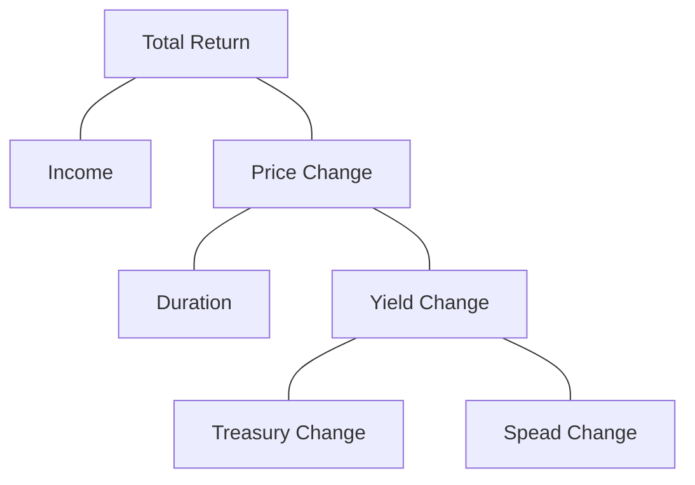

# 经典与调整的 Campisi 归因模型

## 经典模型

> Campisi 的论文中 Table 5 疑似有误，我根据其他表的数据反推出了正确的表。
>
> 我根据 Campisi 的公式重新实现了论文中主要表格的计算，以供读者举一反三自行扩展，下载地址在这里：[Campisi.zip](https://github.com/xuruilong100/xuruilong100.github.io/blob/main/files/Campisi.zip)

### 债券组合回报率的分解

债券组合的总回报分解为收入效应与价格效应的和：
* 收入效应 = 票息 ÷ 价格
* 价格效应 = （期末价格 ÷ 期初价格） - 1
* 总回报 = 收入效应 + 价格效应

总回报再做细分：收入效应、国债效应和利差效应，扣除上述三项后的残差称为选择效应。

数据和计算流程：

### 数据准备

归因计算需要每个版块提供以下基础数据：
* 市值占比（%）
* 投资期回报率
* 票息收入
* 期初价格
* 期初久期
* 期初和期末的国债曲线

基础数据衍生出下列数据：
* 面值占比（%）
* 与版块久期匹配的国债利率变化（Duration Matched Treasury）
* 版块利差变化

归因涉及到三种权重：
* 市值占比
* 面值占比
* 久期贡献 = 市值占比 $\times$ 久期再除以平均久期。

风险（久期）和回报率按照市值占比加权。票息和价格按照面值占比加权。利率变化（国债利率、利差和到期利率）按照久期贡献加权。

### 计算回报率的各个成分

* 收入效应 = 票息 ÷ 价格
* 国债效应 = -久期 $\times$ 国债利率变化（久期匹配）
* 基准的利差效应 = 总回报 - 国债效应 - 收入效应
  * 基准的利差变化 = 利差效应 ÷ -久期。基准的利差变化用于计算组合的利差效应。
* 组合的利差效应 = -久期 $\times$ 基准的利差变化

每个版块可以再细分为子版块，例如，政府债券细分为国债和政府机构债券，公司债还可以按行业细分。

回报率分解完成后，组合回报与基准回报相减便得到归因结果。

### 平行与非平行的国债效应

价格变动可以进一步分归因到利率曲线的平行和非平行变动上。

曲线的水平变动如何表示？Campisi 的做法是在组合平均久期附近选择流动性最好的关键期限。

平行变动回报（Shift）与非平行变动回报（Twist）：
* 国债效应 = -久期 $\times$ 国债利率变动 = Shift + Twist
* 平行变动效应 = -久期 $\times$ 关键期限的利率变动，关键期限的利率变动是指视作平行变动的特殊期限上的国债利率变动。
* 平行变动回报 = -久期 $\times$ （久期匹配的国债利率变动 - 关键期限的利率变动）

## 调整的 Campisi 模型

在 Campisi 模型的具体分析中，又衍生出两种模式的算法，一种基于持仓（Portfolio-based），一种基于净值（Return-based）。其中基于持仓的分析（PBA）是从基金的持仓出发，对持仓标的和持仓仓位变化等进行分析，进而获取持仓特点情况，优势是能准确分析出基金的持仓风格以及风格漂移的情况，缺点是需要完整的持仓数据和持仓变化情况;基于净值的分析（RBA）是指从基金的净值出发，通过构造因子指标等解释变量，通过统计模型来推断基金对于各因子的风格暴露和风格漂移的情况，优势在是容易实现（不需要持仓明细，只需要净值数据），缺点是模型结果不够准确。

我国公募债券基金的持仓数据每年只公布四次，每次只公布前五大重仓债券，因此如果采取 PBA 的分析方法，实证效果会较差。而净值数据是完整的，我们选择 RBA 方法来进行业绩归因，基于净值数据的 Campisi 模型调整为类似于 Bara 多因子模型的架构，具体模型如下:

$$
y = \alpha + \beta * X + \epsilon
$$

* $y$ 是债券类基金的单位净值增长率时间序列（采用周收益率序列） 。
* $X$ 是业绩归因的影响因子。
* $\alpha$ 表示超额收益部分，代表了该基金的超额收益能力情况。
* $\beta$ 为各个因子的暴露值，体现了各个因子的影响程度。
* $\epsilon$ 为模型残差。

结合 Campisi 业绩分解，主要考虑久期管理收益（Level） 、利率曲线结构配置收益（Slope）和信用结构收益三个方面。其中信用结构收益可以分解为信用利差（Default）和评级利差（Credit）。同时考虑到持有可转债资产的债券类基金的收益有很大部分来自于可转债，因此对于这类基金，增加一个可转债因子（Convertible）。在具体的因子构建上，还需要降低因子间的相关性，消除多重共线性的影响。

| 因子名称                | 算法说明                                                                                                                                                                                                                                |
| ----------------------- | --------------------------------------------------------------------------------------------------------------------------------------------------------------------------------------------------------------------------------------- |
| 久期因子（Level）         | 中债国债总财富（总值）指数 - 无风险收益该因子刻画利率曲线水平的变动引起的债券收益率的变动情况，反映基金经理在久期管理上的能力。其中无风险收益采用一年定期存款利率（税前）。                                                                 |
| 期限结构因子（Slope）     | 构建组合，买入中债中短期债券财富（总值）指数，卖出中债长期债券财富（总值）指数。每阶段通过调整两个指数的比例，实现组合久期中性，与久期因子实现剥离。该因子刻画利率曲线斜率变动引起的债券收益率的变动情况，反映基金经理在期限结构上的管理能力。 |
| 信用利差因子（Credit）    | 构建组合，买入中债企业债 AAA 财富（总值）指数，卖出中债国开行债券总财富（总值）指数。每阶段通过调整两个指数的比例，实现组合久期中性，与久期因子实现剥离。该因子刻画信用利差波动引起的债券收益率变化情况，反映基金经理在信用债管理上的能力。    |
| 评级利差因子（Default）   | 构建组合，买入中债高收益企业财富（总值）指数，卖出中债企业债 AAA 财富（总值）指数。每阶段通过调整两个指数的比例，实现组合久期中性，与久期因子实现剥离。该因子刻画了不同信用评级引起的债券收益率变化情况，反映基金经理在信用管理上的能力。      |
| 可转债因子（Convertible） | 中证转债指数 - 无风险收益该因子刻画可转债收益的变动引起的债券收益率的变动情况，反映基金经理在可转债上的管理能力。其中无风险收益采用一年定期存款利率（税前）。                                                                            |

绝大部分纯债类基金能够获得正 alpha（符合预期，收益来自于利息收入），随着持有偏股性资产的增多，获得正 alpha 越来越困难。从模型解释度 $R^2$ 和 alpha 来看，在进行基金优选的时候，可以考虑优先选择模型解释度较高，alpha 收益较高的基金。

## 研报与论文

* Stephen Campisi, CFA, *A Sector Based Approach to Fixed Income Performance Attribution*
* 平安证券，《纯债基金的业绩归因与优选》