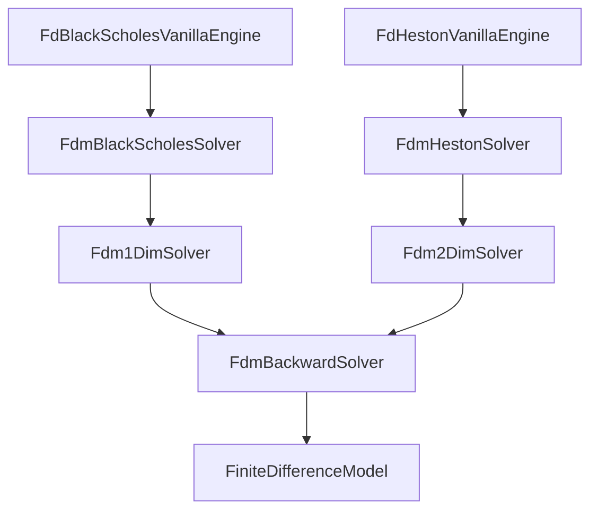
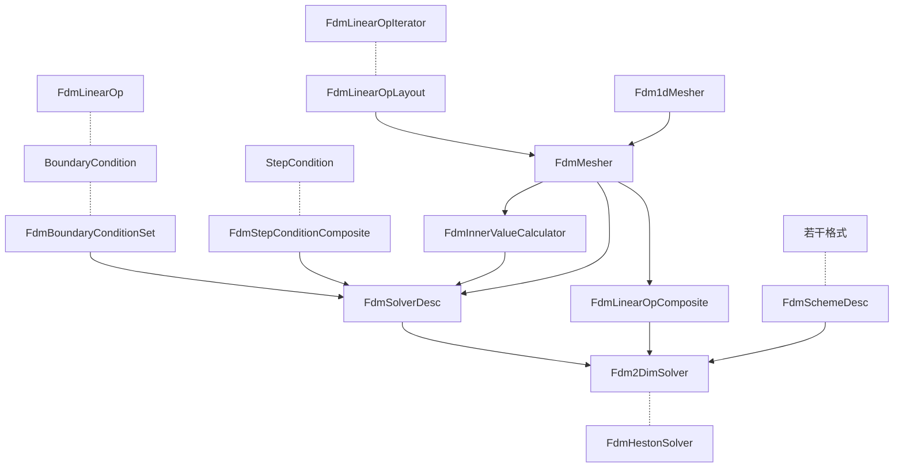

# QuantLib 金融计算——原理之有限差分法（FDM）

## 概述

如果 [Monte Carlo 定价方法](https://xuruilong100.github.io/posts/QuantLib-%E9%87%91%E8%9E%8D%E8%AE%A1%E7%AE%97%E5%8E%9F%E7%90%86%E4%B9%8B%E8%92%99%E7%89%B9%E5%8D%A1%E6%B4%9B/)的复杂程度相当于一台汽车发动机，有限差分（FDM）定价方法的复杂程度无疑相当于一台航空发动机。

## FDM 的基本结构

怎样用 FDM 求解衍生品定价问题？

首先，要有描述衍生品价格的 PDE，包括边界条件、初始状态中间事件（例如支付股息）等等。

其次，在一个充分大的闭区间内划定网格，在网格上构造 PDE 的离散近似。

第三，规定合适的求解格式，例如隐式欧拉格式和 Crank-Nicolson 格式，求解格式、网格上的离散近似和边界条件共同决定了一系列数值线性代数问题。逐一迭代求解数值线性代数问题就可以最终得到衍生品的定价。

## QuantLib 中的 FDM

由于 FDM 的复杂程度远大于 Monte Carlo，在这种情况下，相较于类的“继承”，**类的“组合”才是一个更合适的选择**。因此 QuantLib 中的 FDM 定价引擎没有采用“模板方法模式”，而是根据 FDM 的基本结构归纳总结出若干独立组件，将不同的组件拼合在一起，最终形成一个定价引擎。

尽管不存在一个基类来控制所有计算过程，FDM 定价引擎却有一条共同的“求解链条”。

以 `FdBlackScholesVanillaEngine` 和 `FdHestonVanillaEngine` 为例，定价计算分别委托给了 `FdmBlackScholesSolver` 和 `FdmHestonSolver`。两个 Solver 再各自将计算任务委托给 `Fdm1DimSolver` 和 `Fdm2DimSolver`。无论是一维、二维、三维还是 N 维的 Solver，计算任务统一委托给 `FdmBackwardSolver`，`FdmBackwardSolver`再委托给 `FiniteDifferenceModel`。特定的定价引擎仅负责构造出合适的“组件”对象，并将组件拼合在一起形成一个 Solver，最终是 `FiniteDifferenceModel` 直接或间接调用各个组件完成定价计算。

下面以 `FdHestonVanillaEngine` 为例展示主要组件之间的关系。

`FdmSchemeDesc` 用于描述“求解格式”，`FiniteDifferenceModel` 会根据 `FdmSchemeDesc` 构造出特定的求解格式（例如隐式欧拉格式和 Crank-Nicolson 格式），求解格式决定了以何种方式求解数值线性代数问题。

`FdmLinearOpComposite` 是基类的名称，它的派生类 `FdmHestonOp` 描述如何对 Heston PDE 做离散近似（这也就是为什么配置 `FdmLinearOpComposite` 需要用 `FdmMesher`）。

`FdmSolverDesc` 的配置是最复杂的，因为它具体地描述如何求解一个 PDE，因此它需要 `FdmBoundaryConditionSet`、`FdmStepConditionComposite`、`FdmInnerValueCalculator` 和 `FdmMesher`，分别用来描述边界条件、步骤条件（例如支付股息）、初始值计算和网格划分。

`FdmMesher` 是基类的名称，最常用的是它的派生类 `FdmMesherComposite`。如果需要描述二维网格的话，`FdmMesherComposite` 要接受两个 `Fdm1dMesher` 对象，分别描述各自维度上的网格如何划分。

在求解数值线性代数问题时，状态价格以一维向量的形式出现，而 Heston PDE 是两维的。如何操纵网格，将状态价格切片（一个二维的平面）映射成一维向量是 PDE 数值解过程中最精巧的部分。完成这一步就需要用到 `FdmLinearOpIterator` 和 `FdmLinearOpLayout`。`FdmLinearOpLayout` 可以描述多维网格上点与点之间的相邻关系，借助 `FdmLinearOpIterator` 则可以遍历一个多维网格。

## FDM 与 Autocall

怎样扩展当前的架构以适应 Autocall Note 的估值？

Autocall Note 的特点是在一系列离散的观察日期（通常间隔一个月）上设置障碍值，当标的价格突破障碍时则会支付相应的票息。很显然，Autocall Note 支付票息的这种行为是一种 Step Condition，因此可以编写一个 `StepCondition` 的派生类来模拟观察日期上支付票息的行为。

当前的架构存在一个特殊概念——阻尼，也就是 Rannacher 平滑（文献【1】）， `FiniteDifferenceModel` 在计算状态价格的时候，如果遇到非平滑的输入就直接采用隐式欧拉格式求解 PDE，其他情况下依然按照事先设定的求解格式。

常见的期权仅在到期日这一天会出现不平滑的状态价格，所以当前的架构设计成阻尼仅作用于初始计算阶段。Autocall Note 支付票息的行为却会在求解过程中多次制造出不平滑的状态价格，因此需要修改 `FiniteDifferenceModel` 以支持连续使用 Rannacher 平滑，这并不是难事。

## 启发

另一个流行的 Autocall Note 定价法是积分法（文献【2】），积分法在形式上和 FDM 非常相似，现有 FDM 框架归纳出的组件和流程也很有普适意义，因此可以参考 FDM 的代码实现为积分法设计一个通用框架。

## 参考文献

【1】Luskin, Mitchell, et al. “On the Smoothing Property of the Crank-Nicolson Scheme.” *Applicable Analysis*, vol. 14, no. 2, Jan. 1982, pp. 117–35. *DOI.org (Crossref)*, https://doi.org/10.1080/00036818208839415.
【2】Huang, Min, and Guo Luo. “A Simple and Efficient Numerical Method for Pricing Discretely Monitored Early-Exercise Options.” *Applied Mathematics and Computation*, vol. 422, June 2022, p. 126985. *DOI.org (Crossref)*, https://doi.org/10.1016/j.amc.2022.126985.
